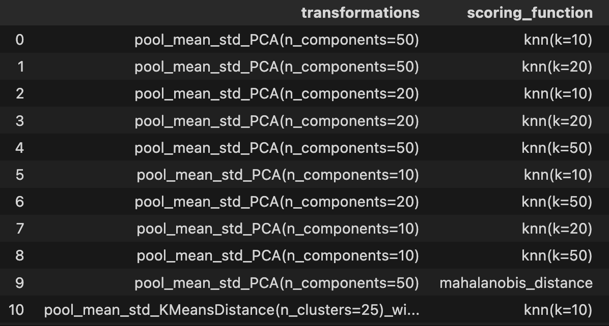

# Things I've tried

I'll keep the best result in example.ipynb.

For now, fix some layer $l \in \{1, 2, ..., 24\}$. Given an input tensor of shape $(L,)$, the $k$th hidden layer will have shape $(L, D)$ where $D=2048$ is the hidden dimension and $L=120$ is the length of input sequences (length of sliding window in the jambot as of now, equal to 40 events). Concatenating this into a $120 \times 2048$ dimensional vector and immediately doing OOD detection on this is not feasible because

1. It's not computationally feasible
2. High-dimensional issues: transformations may remove information. For example, even if $\bold{v}$ is high-dimensional and NOT Gaussian, for most vectors $\bold{r}$ we have $\bold{r} \cdot \bold{v}$ is still Gaussian.

A good preprocessing step reduces the $(L, D)$ tensor into a vector of smaller dimension.
Example (pool_mean_std): across the sequence dimension, compute the mean $(D,)$ and std $(D,)$ and concatenate to get a $(2D,)$ vector.

Once the preprocessing is done, the number of dimensions is still large given the amount of data available. PCA loses much information, even 100 components is not enough as one would expect (see pca_explained_variance).

## Experiment 1: Methods with no density estimation

See ```main/ood_detection_experiments.py.```

I experiment with OOD detectors of the following format.
1. Take the $l=12$th layer, pool from $(L, D)$ input to a smaller vector (call this the 'pooled vector'). Pooling methods include pooling mean and std as above, taking some number of $D$ dim vectors and concatenating them etc. Optionally include preprocessing steps like normalization and PCA.
2. Compute a score that compares a new input to some function of the ID pooled vectors.
- k-nearest neighbors: take the mean of the k nearest neighbors' distances
- Mahalanobis distance (proper use assumes the ID pooled vectors follow a Gaussian which they don't)



Iterated over various parameters and compared using AUROC. The top 10 show:
1. For pooling functions, taking the mean and std (pool_mean_std) is better than computing $k$ cluster means and using distances to the $k$ means as the pooled vector.
2. Using k nearest neighbors distance as the score (for k = 5) is better than Mahalonobis distance.
(After this I tried k<5 and it's not much better)


## Experiment 2: Fit a Gaussian Mixture model

1. Empirically around 4 components is best after doing PCA.
2. Using EM to fit the model is better than neural network (I coded up the neural network then removed it because it's bad at converging).
3. There are a few ways to compute the OOD score.
- Negative log density.
- Min Mahalanobis score to nearest cluster. 


None of them are good enough yet. Expected AUROC ~ 0.9 range.

| metric                | num_pca_components = 20 | 50 | 100 |
|-----------------------|------------------------|---|---|
| negative log density  | 0.69                   | 0.73 | 0.78 |
| min maha distance     | 0.67                   | 0.70 | 0.75 |

4. Right now it seems like later layers are better! Layer 17 is optimal (whichlayer.png), see visualization.png for what the OOD score distribution looks like.

